# Nummo Knowledge Vault 🧭

Welcome to the central knowledge system for **Nummo** — a high-performance, offline-first personal finance ledger built with Flutter for Android and Web.

---

## 🕸️ Interactive Knowledge Graph

```mermaid
graph TD
    %% Styling tokens
    classDef hub fill:#1e1e2e,stroke:#89b4fa,stroke-width:3px,color:#ffffff;
    classDef struct fill:#181825,stroke:#cba6f7,stroke-width:2px,color:#cdd6f4;
    classDef decision fill:#181825,stroke:#a6e3a1,stroke-width:2px,color:#cdd6f4;
    classDef problem fill:#181825,stroke:#f38ba8,stroke-width:2px,color:#cdd6f4;
    classDef progress fill:#181825,stroke:#fab387,stroke-width:2px,color:#cdd6f4;
    classDef ref fill:#181825,stroke:#f9e2af,stroke-width:2px,color:#cdd6f4;

    Home["🧭 Home Vault Hub"]:::hub
    Structure["🗺️ [[Structure]]"]:::struct

    subgraph Decisions ["🧠 Architectural Decisions"]
        D1["[[Decisions/001-offline-first-architecture|001: Offline Storage & RAM Cache]]"]:::decision
        D2["[[Decisions/002-uber-grade-design-system|002: Uber Design System]]"]:::decision
        D3["[[Decisions/003-pin-and-biometric-security-guard|003: PIN Crypto & Lock Guard]]"]:::decision
        D4["[[Decisions/004-export-multiplatform-strategy|004: Multiplatform Export]]"]:::decision
        D5["[[Decisions/005-chronological-running-balance|005: Running Balance Engine]]"]:::decision
    end

    subgraph Problems ["🛠️ Problems & Bug Solves"]
        P1["[[Problems/001-android-secure-storage-caching|001: Android Keystore Startup Lag]]"]:::problem
        P2["[[Problems/002-web-export-blob-download-failure|002: Web Blob Export Crash]]"]:::problem
        P3["[[Problems/003-json-trailing-comma-config-syntax-error|003: JSON Trailing Comma Error]]"]:::problem
    end

    subgraph Progress ["📈 Progress Logs"]
        PR1["[[Progress/2026-08-session-log|2026-08: v1.2.0 & Storage Refactor]]"]:::progress
    end

    subgraph Reference ["📚 Reference & Configs"]
        R1["[[Reference/tech-stack-and-versions|Tech Stack & Dependencies]]"]:::ref
        R2["[[Reference/credentials-and-keystore-locations|Keystore & Key Locations]]"]:::ref
        R3["[[Reference/deployment-and-build-commands|Build & Release Commands]]"]:::ref
        R4["[[Reference/external-links-and-resources|External Links & Assets]]"]:::ref
    end

    %% Central connections
    Home --> Structure
    Home --> Decisions
    Home --> Problems
    Home --> Progress
    Home --> Reference

    %% Inter-note knowledge relationships
    P1 -.->|Resolved by| D1
    P2 -.->|Resolved by| D4
    P3 -.->|Logged in| PR1
    D1 -.->|Used in| Structure
    D2 -.->|Applied to| Structure
    D3 -.->|Protects| D1
    D5 -.->|Calculated in| Structure
    R3 -.->|Builds| Structure
```

---

## 🗺️ Navigation Index

### 1. 🏗️ Architecture & Structure
- **[[Structure]]** — Full structural map of codebase files, module layers, and architectural responsibilities.

### 2. 🧠 Architecture & Design Decisions (`Decisions/`)
- **[[Decisions/001-offline-first-architecture|001: Offline-First Architecture & Dual-Write Storage]]** — Zero-backend local persistence with RAM caching + encrypted storage.
- **[[Decisions/002-uber-grade-design-system|002: Uber-Grade Modern Design System & Tokenization]]** — Obsidian surfaces, haptics, rounded geometry, and monospace tabular currency.
- **[[Decisions/003-pin-and-biometric-security-guard|003: PIN Hashing & Biometric App Lock Guard]]** — Cryptographic PIN security, `local_auth`, and lifecycle lockout enforcement.
- **[[Decisions/004-export-multiplatform-strategy|004: Multiplatform Export Engine]]** — Conditional import abstraction supporting PDF, Excel, and CSV across Web & Android.
- **[[Decisions/005-chronological-running-balance|005: Chronological Running Balance Computation]]** — Dynamic recalculation engine for transaction consistency.

---

### 3. 📈 Development Progress (`Progress/`)
- **[[Progress/2026-08-session-log|2026-08: Dual-Write Secure Storage, V1.2.0 Release & Global Tooling Setup]]** — V1.2.0 release milestones, storage optimizations, and VS Code user environment setup.

---

### 4. 🛠️ Troubleshooting & Issue Log (`Problems/`)
- **[[Problems/001-android-secure-storage-caching|001: Android EncryptedSharedPreferences Cold Startup Lag]]** — Resolved Keystore latency with in-memory dual-write RAM caching.
- **[[Problems/002-web-export-blob-download-failure|002: Cross-Platform File Downloader Failure on Web vs Android]]** — Resolved `dart:io` Web crashes with conditional browser Blob downloads.
- **[[Problems/003-json-trailing-comma-config-syntax-error|003: VS Code User Settings JSON Trailing Comma Error]]** — Fixed syntax validation breakage in global settings.

---

### 5. 📚 Quick Reference & Ops (`Reference/`)
- **[[Reference/tech-stack-and-versions|Tech Stack & Dependency Matrix]]** — SDKs, plugins, and package versions.
- **[[Reference/credentials-and-keystore-locations|Keystore & Key Locations]]** — Paths to release keystores and config files (no secrets).
- **[[Reference/deployment-and-build-commands|Build & Release Commands]]** — Web, APK, and testing CLI recipes.
- **[[Reference/external-links-and-resources|External Links & Documentation]]** — Repository URLs, deployment targets, and assets.
