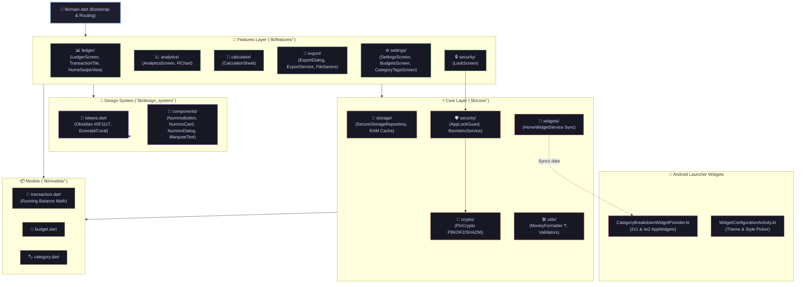

# Codebase Structure & File Map 🗺️

This document outlines the architecture, layer responsibilities, and directory structure of the **Nummo** repository.

---

## 🕸️ Interactive Subsystem Flowchart



---

## 📂 Directory Layout

```
Nummo/
├── .agents/                   # AI agent instructions & pre-release audit rules
│   ├── AGENTS.md              # Core constraints & Uber-grade design principles
│   ├── PRE_RELEASE_AUDIT.md   # Zero-data-loss verification checklist
│   └── mcp_config.json        # MCP server tool connections
├── android/                   # Native Android host configuration
│   ├── app/
│   │   ├── build.gradle.kts   # App-level build config, signing & target SDKs
│   │   ├── nummo-release.jks  # Production release keystore file
│   │   └── src/main/kotlin/com/krajtilak/nummo/
│   │       ├── MainActivity.kt
│   │       ├── CategoryBreakdownWidgetProvider.kt # 2x1 & 4x2 Home Screen Widgets
│   │       └── WidgetConfigurationActivity.kt    # Widget appearance config
│   └── key.properties         # Local signing properties (ignored in public VCS)
├── lib/                       # Flutter source code
│   ├── main.dart              # App entrypoint, theme bootstrap, root router & lifecycle
│   ├── core/                  # Shared system-level services
│   │   ├── crypto/            # Cryptographic hashing & PIN security (PBKDF2)
│   │   ├── security/          # App lock lifecycle guard (AppLockGuard) & biometric auth
│   │   ├── storage/           # Dual-write storage repository & encrypted backups
│   │   ├── widgets/           # HomeWidgetService Android AppWidget sync bridge
│   │   └── utils/             # Money formatting (₹) & input validators
│   ├── design_system/         # Reusable UI tokens & atomic components
│   │   ├── tokens.dart        # Obsidian colors, spacing, radii & typography
│   │   └── components/        # NummoButton, NummoCard, NummoDialog, NummoMarqueeText
│   ├── features/              # Feature domain modules
│   │   ├── analytics/         # Spending analytics & FlChart visualizations
│   │   ├── calculator/        # Inline expense math calculator sheet
│   │   ├── export/            # Multiplatform PDF & Excel export engine with worker isolates
│   │   ├── ledger/            # Main transaction ledger, swipe views & filters
│   │   ├── security/          # Lock screen & PIN verification dialogs
│   │   └── settings/          # SettingsScreen, BudgetsScreen & CategoryTagsScreen
│   └── models/                # Domain entities & serialization
│       ├── budget.dart        # Monthly budget targets & alerts
│       ├── category.dart      # Category tags, icons & color presets
│       └── transaction.dart   # Transaction entity & chronological running balance
├── logo/                      # Vector SVGs, raster PNGs & app icon generation
├── test/                      # Comprehensive unit & widget test suites (120+ tests)
│   ├── unit/                  # Unit tests for models, crypto, storage, isolates & guards
│   └── widget/                # Widget UI, overflow regression, and narrow screen tests
├── web/                       # Web release assets, PWA manifest & favicon
│   └── index.html             # HTML5 entry with 16px iOS zoom guard & W3C viewport
├── pubspec.yaml               # Flutter dependencies & assets registry
├── vercel.json                # Vercel static build & header routing configuration
└── Home.md                    # Knowledge Vault Home Hub
```

---

## 🧩 Key Subsystems & Layers

### 1. Presentation & Design System (`lib/design_system/`)
- All surfaces use the tokens defined in `lib/design_system/tokens.dart` (Obsidian `#0F1117`, `#181A22` cards, Emerald Mint `#10B981` credits, Coral Crimson `#F43F5E` debits).
- See **[[Decisions/002-uber-grade-design-system]]**.

### 2. Core Storage & Caching (`lib/core/storage/`)
- Managed by `SecureStorageRepository`. Implements warm in-memory caching and dual-write persistence (`SharedPreferences` + `FlutterSecureStorage`).
- See **[[Decisions/001-offline-first-architecture]]** and **[[Problems/001-android-secure-storage-caching]]**.

### 3. Security & App Lock Guard (`lib/core/security/` & `lib/core/crypto/`)
- Handles PIN hashing with PBKDF2/SHA256, biometric authentication, and app backgrounding lock timer.
- Enhanced with `AppLockGuard` supporting atomic guard counters and a 4-second resume grace period to prevent false locks during native file pickers.
- See **[[Decisions/003-pin-and-biometric-security-guard]]** and **[[Problems/005-system-file-picker-premature-auto-lock]]**.

### 4. Cross-Platform Export Engine (`lib/features/export/`)
- Heavy PDF and Excel construction runs in background isolates (`compute()`) with dynamic pagination and sanitized Type1 typography.
- See **[[Decisions/004-export-multiplatform-strategy]]**, **[[Decisions/007-isolate-background-export-processing]]**, and **[[Problems/004-pdf-export-toomanypages-and-anr-lag]]**.

### 5. Android Home Screen Widgets (`android/.../nummo` & `lib/core/widgets/`)
- Native 2x1 and 4x2 home screen widgets showing monthly expense totals and category breakdowns with live background broadcast sync.
- See **[[Decisions/006-android-homescreen-widgets-integration]]**.

---

## 🔗 Related Notes
- **[[Home]]** — Knowledge Vault Home Hub
- **[[Progress/2026-09-session-log]]** — September 2026 Milestone Log
- **[[Reference/tech-stack-and-versions]]** — Package and tool versions
- **[[Reference/deployment-and-build-commands]]** — Build and release commands
